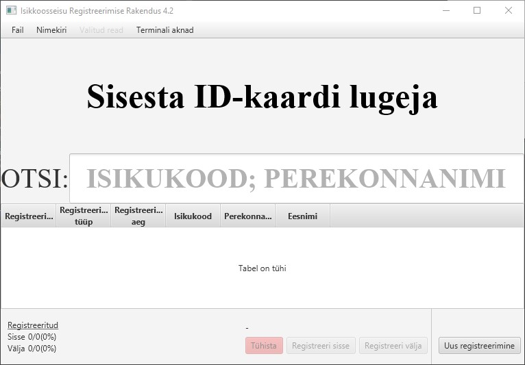

# Personnel Registration Application

Personnel Registration Application is used for **quick registration** of personnel
using **Estonian ID-cards**. It manages personnel registration in a searchable table.

## Getting Started

[Java 8](https://www.java.com/en/download/) is required to run this application. 
It uses JavaFX which is still included in Java 8 but not in later versions of the SDK.
This application works in Windows and Linux operating systems.

## Build

Project is configured to be easily compiled with Maven or IntellJ IDEA.

### Maven
1. Make sure environment variable `JAVA_HOME` is set to Java 8.
2. Run command `mvn package -DskipTests`
3. Compiled application is at `./target/isikreg-4.2.jar`

### IntelliJ IDEA
1. Open the project folder with IntellJ IDEA
2. Ensure that Project SDK is 1.8 (`File > Project Structure > Project > Project SDK > 1.8`)
3. Build with `Build > Build Artifacts > isikreg-4.2:jar > Build`
4. Compiled application is at `./target/isikreg-4.2.jar`

## Key Features
- Estonian ID-card support using PC/SC
- Supports multiple concurrent card readers
- Separate feedback window per card reader
- Excel file import / export
- Auto merge multiple excel files
- Fully customizable table columns and settings

## Documentation
- [User Manual](docs/isikreg_kasutusjuhend_4.2.pdf)
- [Alert Quick Start Manual](docs/isikreg_häire_lühijuhend_4.2.pdf)
- [Settings Documentation](docs/isikreg_seadete_dokumentatsioon_4.2.pdf)
- [Settings Examples](docs/seadete_näited)
- [Version History](docs/versiooni_ajalugu.md)

## Technologies
- Java
- JavaFX
- PC/SC
- Excel

## Tests
Tests are written with JUnit and TestFX.

### Run tests
Run command `mvn test`. 

By default, TestFX runs headless.
You can disable this by changing `pom.xml` file:  
from `<testfx.headless>true</testfx.headless>` to `<testfx.headless>false</testfx.headless>`.

## License
Personnel Registration Application is MIT licensed.